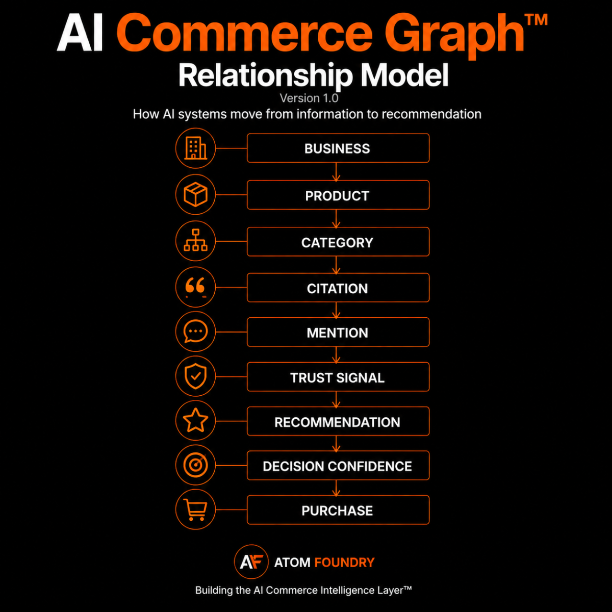

# AI Commerce Graph™

## The Infrastructure Layer Behind AI Commerce Intelligence™

Daniel Pokorny  
Atom Foundry  
June 2026

---

## Introduction

The internet was built for humans.

Search engines helped organize information by creating relationships between websites, entities, concepts, and facts. Over time, these relationships evolved into what became known as Knowledge Graphs.

Today a new layer is emerging.

AI systems are no longer just retrieving information. They are increasingly responsible for discovering businesses, evaluating products, comparing options, making recommendations, and influencing purchasing decisions.

As this shift accelerates, a new challenge appears.

How do AI systems decide what to recommend?

The answer is more complex than rankings, keywords, backlinks, or visibility.

Recommendations emerge from a network of relationships.

We call this network the AI Commerce Graph™.

---

## The Shift From Search To Recommendations

For more than two decades businesses optimized for search engines.

The goal was simple.

Be visible when someone searched.

The rise of AI changes the objective.

Customers increasingly ask AI systems for advice, comparisons, product recommendations, buying guidance, and decision support.

Instead of navigating search results, users receive curated answers.

Instead of evaluating dozens of websites, users receive a shortlist.

Instead of searching for information, users ask for recommendations.

The competitive battleground is moving from visibility to recommendation.

---

## Search Engines Built Knowledge Graphs

Knowledge Graphs helped search engines understand relationships between entities.

A person could be connected to a company.

A company could be connected to a product.

A product could belong to a category.

These relationships improved search quality and entity understanding.

Knowledge Graphs were built to answer questions.

AI systems face a different challenge.

They must answer a more difficult question.

What should I recommend?

---

## Why Recommendations Are Different

A recommendation requires more than information.

An AI system must determine:

Is this business relevant

Is this business understood

Is this business trustworthy

Is this business appropriate for the intent

Is this business likely to satisfy the user

Recommendations require confidence.

Confidence requires relationships.

Those relationships form a graph.

---

## The AI Commerce Graph™

The AI Commerce Graph™ is a conceptual model describing how AI systems connect businesses, products, categories, mentions, trust signals, citations, and recommendations.

It is an attempt to understand the infrastructure behind AI driven commerce.

At its core, the graph maps relationships between:

* Businesses
* Products
* Categories
* Mentions
* Citations
* Trust Signals
* Recommendations
* Customer Intent

These entities interact continuously as AI systems evaluate possible answers.

---

## Core Relationships

A business sells products.

Products belong to categories.

Businesses receive mentions.

Mentions become citations.

Citations contribute to trust.

Trust influences recommendations.

Recommendations influence purchase decisions.

Purchase decisions create new signals.

Those signals feed back into the graph.

The system becomes self reinforcing.

The stronger the relationships, the stronger the recommendation potential.

---

## The Recommendation Flow

Discovery

↓

Understanding

↓

Trust

↓

Recommendation

↓

Decision Confidence

↓

Purchase

Most businesses focus only on visibility.

AI systems operate across the entire chain.

A business can be visible and still fail to be recommended.

A business can be recommended and still fail to create confidence.

The AI Commerce Graph™ provides a framework for understanding the entire process.

---

## The Five Layers Of AI Commerce Intelligence™

The AI Commerce Graph™ serves as the infrastructure layer behind five connected frameworks.

### AI Readability™

Can AI access and extract information from the business?

### AI Understanding™

Does AI correctly understand what the business sells and who it serves?

### AI Trust™

Does AI have sufficient confidence in the business?

### Recommendation Intelligence™

How often and for which intents is the business recommended?

### Decision Confidence™

How much confidence does a recommendation create before purchase?

Together these layers form the AI Commerce Intelligence™ stack.

---

## Why This Matters

Most businesses still optimize for traffic.

AI systems optimize for confidence.

The companies that understand how recommendations are formed will have a significant advantage as AI driven discovery expands.

The future winners may not be the businesses with the most visibility.

They may be the businesses with the strongest position inside the recommendation graph.

Understanding those relationships is becoming increasingly important.

Not just for marketers.

For every business that depends on discovery, trust, and customer decisions.

---

## Looking Ahead

The AI Commerce Graph™ is not a finished model.

It is an ongoing research initiative.

As AI systems evolve from information retrieval to recommendation engines and eventually autonomous purchasing agents, understanding recommendation infrastructure becomes increasingly important.

Our goal is to contribute to that understanding.

The AI Commerce Graph™ is one attempt to map the emerging architecture behind AI driven commerce.

---

## About Atom Foundry

Atom Foundry is building AI Commerce Intelligence™.

Our research focuses on how AI systems discover, understand, trust, recommend, and influence purchasing decisions across ecommerce.

Learn more

https://atomfoundry.dev

GitHub

https://github.com/Atom-Foundry
