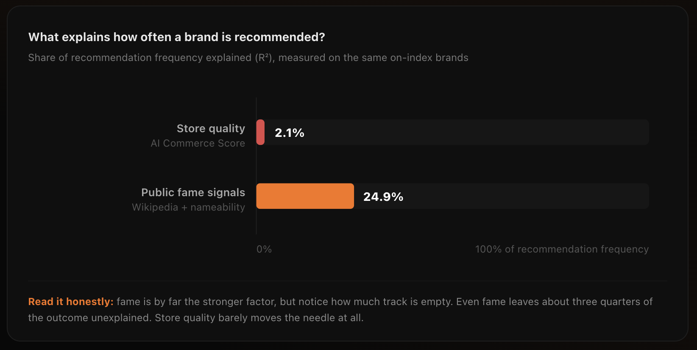
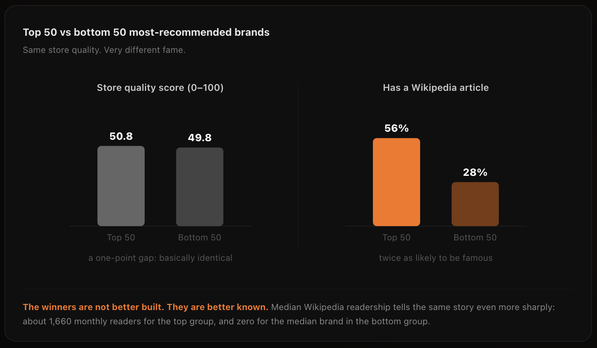
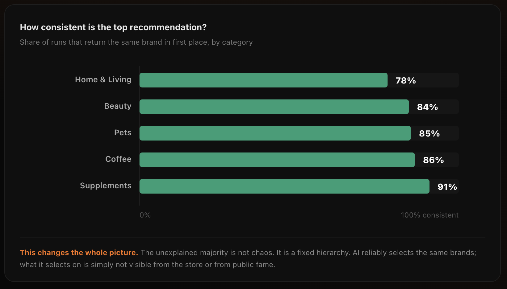

# AI Recommends by Fame, Not Store Quality 2026

We took the 200 most-recommended brands across five ecommerce categories and asked what actually separates the brands AI names from the brands it ignores.

The answer is not how good their store is.

It is how famous they are.

And even fame explains only a quarter of it.

**Atom Foundry · June 2026 · Part Two of the Recommendation Intelligence Research™ Series**

---

## At a Glance

| Metric | Value |
|----------|----------|
| Brands analyzed | 200 |
| Explained by fame | 24.9% |
| Explained by store quality | 2.1% |
| Fame vs quality | ~12× stronger |

---

## Where This Comes From

### First We Proved Store Quality Does Not Drive Recommendation

In the first part of this research program, we captured 20,000 AI product recommendations across Beauty, Supplements, Coffee, Pets, and Home & Living.

We matched every recommendation to the measured AI readiness of the real store behind the brand.

Across all five categories, the relationship between store quality and recommendation frequency was statistically indistinguishable from zero.

That answered one question and created a much harder one:

If a clean, well-structured, machine-readable store does not earn recommendations, what does?

This study attempts to answer that question using the same approach:

- Real recommendation data
- Real brand measurements
- No estimated deltas
- No invented scoring

---

# The Headline Finding

## Fame Outweighs Store Quality Roughly Twelve to One

We measured public fame signals that exist independently of the store itself:

- Wikipedia readership
- Number of language editions
- Article length
- Brand name length and nameability

We then compared those signals directly against recommendation frequency.

For comparison, we also tested each brand's AI Commerce Score™.

### What Explains How Often A Brand Is Recommended?

### Results

| Factor | Share of Recommendation Frequency Explained (R²) |
|----------|----------|
| Store Quality (AI Commerce Score™) | 2.1% |
| Fame Signals | 24.9% |

Store quality barely moves the needle.

Public fame explains roughly twelve times more recommendation behavior than store quality.

Yet even fame leaves most of the outcome unexplained.

That turns out to be important.

---

# The Same Finding In Plain Brands

## The Most Recommended And Least Recommended Brands Have Nearly Identical Stores

Regression can feel abstract.

So we tested the result another way.

We sorted the 200 brands by recommendation frequency and compared:

- Top 50 most-recommended brands
- Bottom 50 most-recommended brands

### Top 50 vs Bottom 50 Most-Recommended Brands

### What We Found

| Metric | Top 50 | Bottom 50 |
|----------|----------|----------|
| Average Store Quality Score | 50.8 | 49.8 |
| Has Wikipedia Article | 56% | 28% |

The stores are effectively identical.

The famous brands are recommended far more often.

The winners are not better built.

The winners are better known.

Median Wikipedia readership tells the same story:

- Top group median: ~1,660 monthly readers
- Bottom group median: 0 monthly readers

---

# The Part Most People Get Wrong

## Recommendations Are Not Random

A natural response to the previous finding is:

"Maybe AI recommendation behavior is mostly noise."

We tested that directly.

Every shopping intent was executed twenty times.

Then we measured how often the same brand appeared in the number one position.

### Recommendation Consistency

| Category | Top Recommendation Consistency |
|----------|----------|
| Home & Living | 78% |
| Beauty | 84% |
| Pets | 85% |
| Coffee | 86% |
| Supplements | 91% |

The same brands appear again and again.

Across twenty runs, only a small handful of brands ever reach first place.

The hierarchy is stable.

This changes the interpretation completely.

The unexplained majority is not randomness.

It is structure.

AI consistently chooses the same brands.

We simply do not yet fully understand the mechanism behind those choices.

---

# Three Measurements, One Answer

## Store Quality Barely Matters

Store quality explains approximately:

**2.1%**

of recommendation frequency.

A cleaner, more machine-readable store does almost nothing for how often AI recommends a brand today.

---

## Fame Matters More

Public fame explains approximately:

**24.9%**

of recommendation frequency.

That is roughly twelve times more predictive than store quality.

Yet fame still leaves about three quarters of recommendation behavior unexplained.

---

## Recommendations Are Stable

Top recommendations remain consistent across repeated runs.

The hierarchy exists.

The hierarchy is measurable.

The hierarchy is not random.

---

# What This Means

If your brand is not being recommended today, you are not invisible because of a bad day, bad luck, or random variation.

You are invisible consistently.

And based on current evidence:

- Store quality does not explain it
- Public fame explains only part of it
- Something else is driving the remaining majority

The only way to understand that layer is to measure recommendation behavior directly.

This is the purpose of Recommendation Intelligence™.

---

# Recommendation by Memory™

The evidence increasingly points toward a simple explanation.

Today's AI systems often recommend brands they already know.

Not brands they have recently evaluated.

Not brands with the best stores.

Not brands with the highest AI Commerce Scores™.

Brands they remember.

We call this:

**Recommendation by Memory™**

The alternative future is:

**Recommendation by Understanding™**

A future where AI agents:

- Retrieve information live
- Evaluate stores directly
- Compare options dynamically
- Make recommendations based on understanding rather than memory

Commerce today still appears dominated by memory.

That creates an advantage for established brands.

It also creates risk.

Because once recommendation shifts from memory to understanding, the brands winning today may no longer be the brands winning tomorrow.

---

# Method & Honesty

### Brands Analyzed

200 most-recommended brands across:

- Beauty
- Supplements
- Coffee
- Pets
- Home & Living

### Recommendation Data

- 20 runs per shopping intent
- GPT-4o-mini
- Real recommendation outputs only

### Fame Signals

- Wikipedia readership
- Language editions
- Article length
- Brand name length

### Entity Matching

- Wikidata
- Commercial entities only
- Humans excluded

### Models Used

- Multiple regression
- Spearman correlation
- Recommendation frequency analysis

### Stability Analysis

Top recommendation consistency measured across 20 repeated executions per intent.

---

# Limitations

Wikipedia is a proxy for fame.

It captures encyclopedic prominence, not total commercial awareness.

Signals we believe matter but could not reliably measure include:

- Advertising spend
- Large-scale web mentions
- Reliable Reddit mention volume
- Historical brand exposure

These were intentionally excluded rather than estimated.

Store-quality comparisons rely on brands for which measured stores exist inside the Atom Foundry dataset.

All figures reported are derived from observed recommendation outputs.

No values were estimated, inferred, or simulated.

---

# Key Finding

**AI does not appear to recommend the best-built stores.**

**AI appears to recommend the brands it knows.**

And even fame explains only a fraction of the hierarchy.

The remaining layers are still hidden.

Finding them is the next stage of Recommendation Intelligence™ research.

---

**Atom Foundry**

Building the Recommendation Intelligence Layer™
