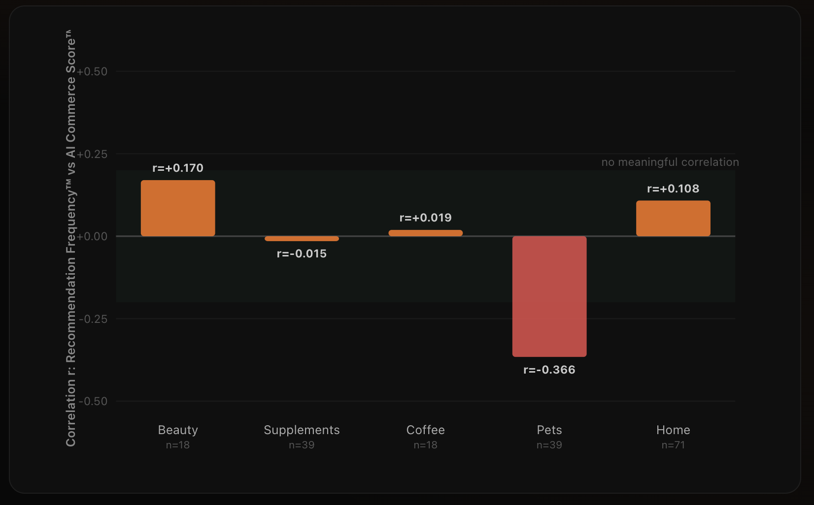
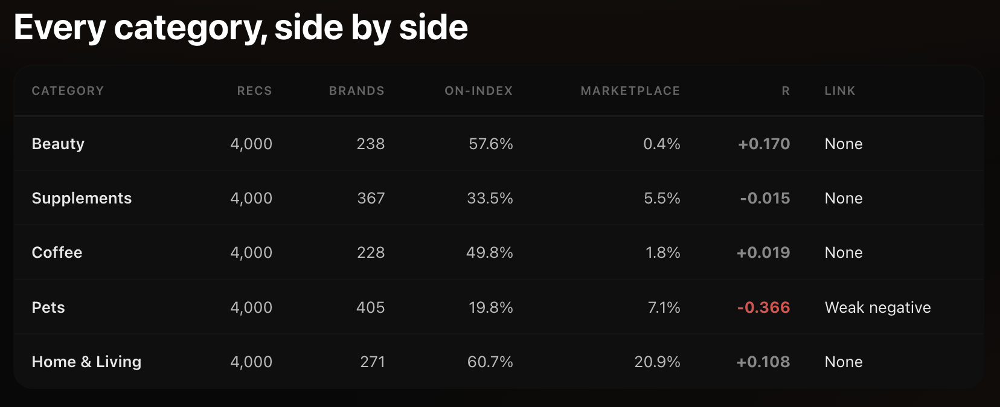

# The State of AI Recommendations Across Commerce 2026

**We captured 20,000 AI product recommendations across five ecommerce categories and matched every one to the real store behind the brand.**

The market is busy asking whether AI can see a brand.

We asked a harder question:

**When AI recommends one brand over another, what is it actually responding to?**

*Atom Foundry · June 2026 · Synthesis of the five-niche Recommendation Intelligence Research™ series*

---

## Research Snapshot

| Metric           | Value  |
| ---------------- | ------ |
| Recommendations  | 20,000 |
| Distinct Brands  | 1,490  |
| Categories       | 5      |
| Shopping Intents | 100    |

---

# The Question

## Visibility is not the same as selection

Most of the AI search market is converging on one number:

Are you visible?

Are you mentioned, cited, and surfaced by AI systems?

That is an important question.

But being mentioned by an AI system and being recommended by one are becoming two very different outcomes.

A brand can appear in the candidate set and never make the shortlist.

The question we set out to answer is simple:

**What moves a brand from visibility to recommendation?**

And more specifically:

**Does store readiness actually influence recommendation frequency?**

---

# The Headline Finding

## Across 20,000 recommendations, readiness did not predict recommendation

For every category we measured:

* Recommendation Frequency™
* AI Commerce Score™

Recommendation Frequency™ measures how often a brand is recommended.

AI Commerce Score™ measures how readable, trustworthy, and machine-legible the underlying store is.

If readiness drove recommendation, we would expect a meaningful positive relationship.

We did not find one.

---

Five categories.

More than 20,000 recommendations.

Not once did recommendation frequency show a meaningful positive relationship with store readiness.

Beauty: near zero.

Supplements: near zero.

Coffee: near zero.

Home & Living: near zero.

Pets: the only category to diverge, and it diverged in the opposite direction.

The conclusion is no longer a single observation.

It is a replicated result.

---

# Every Category, Side by Side

| Category      | Recs  | Brands | On-Index | Marketplace | r      | Link          |
| ------------- | ----- | ------ | -------- | ----------- | ------ | ------------- |
| Beauty        | 4,000 | 238    | 57.6%    | 0.4%        | +0.170 | None          |
| Supplements   | 4,000 | 367    | 33.5%    | 5.5%        | -0.015 | None          |
| Coffee        | 4,000 | 228    | 49.8%    | 1.8%        | +0.019 | None          |
| Pets          | 4,000 | 405    | 19.8%    | 7.1%        | -0.366 | Weak negative |
| Home & Living | 4,000 | 271    | 60.7%    | 20.9%       | +0.108 | None          |

**On-Index** is the share of recommendations that map to a single-brand store we measure.

**Marketplace** is the share that went to retailers and marketplaces, which were excluded from brand-level correlation analysis.

**r** represents the Pearson correlation between Recommendation Frequency™ and AI Commerce Score™.

---

# Pattern Two

## The more everyday the category, the more it runs through marketplaces

A second pattern emerged from the data.

The share of recommendations going to marketplaces rises sharply with how commoditized the category becomes.

| Category      | Marketplace Share |
| ------------- | ----------------- |
| Beauty        | 0.4%              |
| Coffee        | 1.8%              |
| Supplements   | 5.5%              |
| Pets          | 7.1%              |
| Home & Living | 20.9%             |

Beauty recommendations are overwhelmingly brand-led.

Home & Living recommendations increasingly route through marketplaces.

This matters because a marketplace recommendation is fundamentally different from a brand recommendation.

When AI recommends Amazon or Wayfair, it is not making a product decision.

It is deferring the decision.

The jump from 0.4% to 20.9% suggests that in broader and less differentiated categories, AI increasingly hands choice back to a retailer.

---

# What Is Actually Happening

## Recommendation by Memory™, not by Understanding™

If readiness does not drive recommendation, what does?

Across all five categories, the pattern points in one direction.

The brands most frequently recommended are often the brands the model already knows.

Examples include:

* Clinique
* SkinCeuticals
* NOW Foods
* Peet's
* Blue Buffalo
* Purina
* IKEA
* Pottery Barn
* West Elm

These are not necessarily the best-built stores.

Several are not even included in our store index.

Many score surprisingly low on AI Commerce Score™.

Yet they continue to dominate recommendations.

Why?

Because they are famous.

We call this:

## Recommendation by Memory™

The model retrieves familiar names from training memory.

The alternative is:

## Recommendation by Understanding™

A system retrieves, reads, evaluates, compares, and recommends based on live information.

Today, commerce appears to operate primarily on memory.

That is why a famous brand with a weak store often wins.

And why a lesser-known brand with a highly optimized store often loses.

---

# Why It Matters

## The market measures whether AI sees you.

## The harder question is why AI chooses you.

Visibility matters.

Citation tracking matters.

Mention share matters.

But visibility is only the first layer.

Knowing that a brand appears in 30% of answers does not explain:

* Why it appears.
* Why competitors appear instead.
* What changes recommendation probability.

Our data suggests that store readiness alone is not the primary driver of recommendation frequency today.

That means the next question becomes more important than visibility itself:

**Why does AI choose one brand instead of another?**

That question sits at the center of Recommendation Intelligence™.

---

# What Comes Next

The next phase of research focuses on measurable proxies for fame:

* Search demand
* Brand age
* Mention volume
* Citation volume
* Media presence
* Brand awareness

The goal is to quantify exactly how much recommendation behavior is explained by fame versus readiness.

If readiness explains little and fame explains most, the market gains a much clearer picture of how recommendation systems actually behave today.

That is the purpose of the Recommendation Intelligence™ research program.

And it is built on data rather than assumptions.

---

## About Atom Foundry

Atom Foundry researches how AI systems discover, understand, trust, recommend, and influence commerce.

Core frameworks include:

* AI Readability™
* AI Understanding™
* AI Trust™
* Recommendation Intelligence™
* Decision Confidence™
* AI Commerce Intelligence™

Research Repository:

https://github.com/Atom-Foundry/AI-Commerce-Whitepapers
